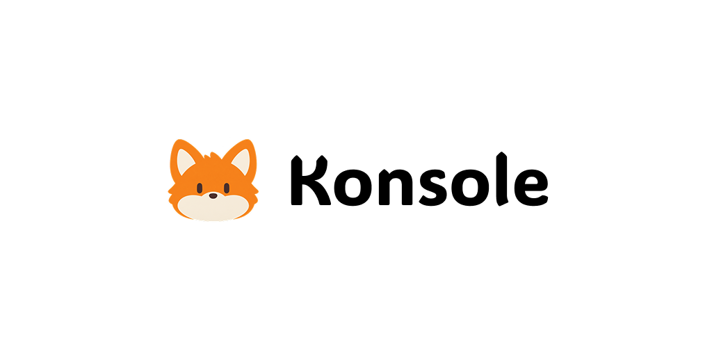

<p align="center">
  
</p>

<p align="center">
  声で呼んで、PC作業を手伝ってくれる相棒「コン」の macOS メニューバーアプリ
</p>

> [!NOTE]
> **これは作者が自分のためだけに作っている個人用アプリです。**
> 自分の Mac・自分の環境・自分の使い方に合わせて作っているので、他の環境での動作確認やサポートはしていません。
> 設定値やパスも作者の環境前提のものがあります。コードは参考用として公開しています。

## コンって何？

アイアンマンの「ジャービス」にインスパイアされた、常駐型のパーソナル AI アシスタントです。
コーディングや資料作成の途中で手を止めずに、声で質問したり作業を頼んだりできます。

名前の由来はキツネの鳴き声「コンコン」と、稲荷信仰の「人を助ける存在」のイメージから。

## できること

- **プッシュトゥトーク** — `⌥Space` で話しかけて、話し終わると自動で聞き取り終了（`esc` でキャンセル）
- **ローカル音声認識** — whisper.cpp（`ggml-large-v3-turbo`）で Mac 上で文字起こし
- **Claude による判断・実行** — `claude` CLI を裏で動かし、ファイル操作やコマンド実行をこなす
- **音声で返答** — VOICEVOX で読み上げ（起動していなければシステム音声にフォールバック）
- **歌詞風の吹き出し** — 右上に返答を表示し、読み上げに合わせて Spotify の歌詞のようにスクロール
- **会話の記憶** — Claude のセッションを引き継いで文脈を保持
- **会話履歴** — プロジェクト内の `History/` に JSONL で保存（`.gitignore` 済み）
- **設定画面** — 話者・話速・抑揚、ショートカットの変更、履歴の検索など

## 設計方針

- **Computer Use（画面操作の模倣）は使わない** — ファイル・コマンド・API 経由で「システムの内側から」動く
- **常時マイクはオンにしない** — ウェイクワードは使わず、ショートカットを押したときだけマイクを開く
  - 聞き取りが終わるたびにオーディオエンジンを破棄するので、待機中に AirPods が通話モード（低音質）になりません
- **権限は Auto モード** — 日常操作は自動、破壊的な操作は確認で止める。`bypassPermissions` は使わない
- **先回りして話しかける機能は作らない** — 呼ばれたときだけ答える

## 構成

```
⌥Space で話しかける
  → マイク入力（AVAudioEngine + 簡易 VAD）
  → whisper.cpp で文字起こし
  → claude CLI（stream-json, セッション継続）
  → 右上の吹き出しに表示 + VOICEVOX で読み上げ
```

| 役割 | 使っているもの |
|---|---|
| アプリ | SwiftUI / AppKit（メニューバー常駐, macOS 26.6+） |
| 音声認識 | [whisper.cpp](https://github.com/ggml-org/whisper.cpp) v1.9.2 |
| 判断・実行 | [Claude Code](https://claude.com/claude-code) CLI |
| 音声合成 | [VOICEVOX](https://voicevox.hiroshiba.jp/) エンジン |
| ホットキー | Carbon `RegisterEventHotKey` |

```
Konsole/
├── AppDelegate.swift          メニューバー・ホットキー・吹き出し・設定ウィンドウ
├── Clients/                   Claude / Whisper / VOICEVOX / マイク / ホットキー
├── Features/                  チャット・吹き出し・設定画面
└── Models/                    設定・ショートカット・履歴
Packages/WhisperCpp/           whisper.cpp の Swift ラッパー
```

## 自分の環境で動かすとき

必要なもの:

- macOS 26.6 以降 / Xcode 26
- `claude` CLI（ログイン済み）
- `ggml-large-v3-turbo.bin` を `~/Library/Application Support/Konsole/models/` に配置
- （任意）`/Applications/VOICEVOX.app` — 入っていれば自動でエンジンを起動します

```sh
xcodebuild -project Konsole.xcodeproj -scheme Konsole -configuration Debug build
```

`claude` をサブプロセスで実行するため App Sandbox は無効にしています。
メニューバーにアイコンが出ないときは「システム設定 → メニューバー」で Konsole の表示を許可してください。

## ライセンス

個人用のため、ライセンスは設定していません。
